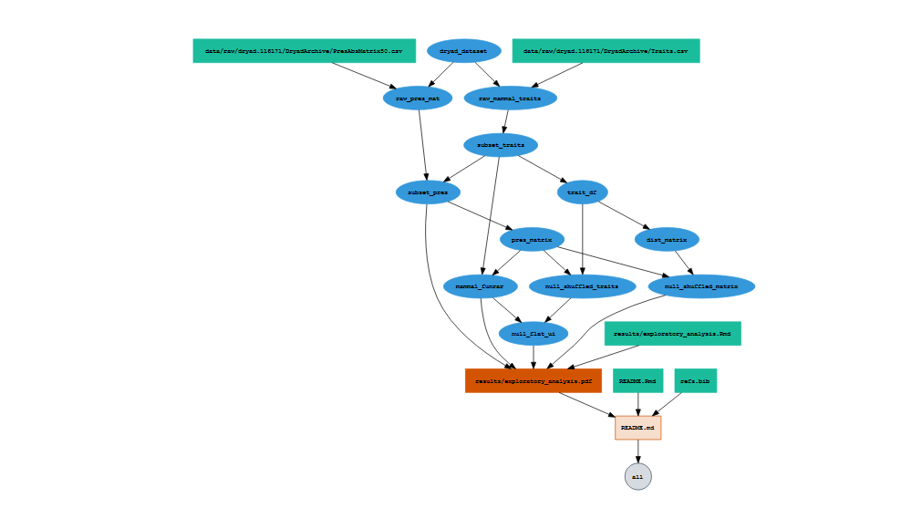

North and Central American Mammals Functional Rarity Read Me
================
Matthias Grenié, Pierre Denelle, Caroline Tucker, François Munoz and Cyrille Violle
2017-03-07

Goal
----

This repository contains a worked through example of the use of [`funrar`R package](https://cran.r-project.org/package=funrar) in the context of biogeography using a publicly available dataset on North and Central American mammals (Lawing et al. 2016b; Lawing et al. 2016a).

The dataset is available through Dryad there: [doi:10.5061/dryad.9t0n8](https://doi.org/10.5061/dryad.9t0n8).

The repository is self-contained and can be used to automatically download [see How to run section](How%20to%20run) and compute the figures shown in the submitted manuscript.

Dependencies
------------

The analysis strongly depends on several packages:

-   [`remake`](https://github.com/richfitz/remake) to make the analysis portable and reproducible,
-   [`dplyr`](https://github.com/hadley/dplyr) for data wrangling,
-   [`rdryad`](https://github.com/ropensci/rdryad) to download the data from Dryad,
-   [`rmarkdown`](https://github.com/rstudio/rmarkdown/) to generate the analysis report,
-   [`vegan`](https://github.com/vegandevs/vegan) to compute null models for site-species matrix,
-   [`ggplot2`](https://github.com/tidyverse/ggplot2) to plot figures in reports,
-   [`devtools`](https://github.com/hadley/devtools) for session info diagnostics,
-   [`funrar`](https://cran.r-project.org/package=funrar) to compute functional rarity indices.

Session Info
------------

The analysis ran using the following system and packages:

``` r
devtools::session_info()
```

    ## Session info --------------------------------------------------------------

    ##  setting  value                       
    ##  version  R version 3.3.2 (2016-10-31)
    ##  system   x86_64, mingw32             
    ##  ui       RStudio (1.0.136)           
    ##  language (EN)                        
    ##  collate  French_France.1252          
    ##  tz       Europe/Warsaw               
    ##  date     2017-03-07

    ## Packages ------------------------------------------------------------------

    ##  package      * version  date       source                          
    ##  assertthat     0.1      2013-12-06 CRAN (R 3.3.0)                  
    ##  backports      1.0.5    2017-01-18 CRAN (R 3.3.2)                  
    ##  brew           1.0-6    2011-04-13 CRAN (R 3.3.0)                  
    ##  codetools      0.2-15   2016-10-05 CRAN (R 3.3.2)                  
    ##  colorspace     1.3-2    2016-12-14 CRAN (R 3.3.2)                  
    ##  crayon         1.3.2    2016-06-28 CRAN (R 3.3.0)                  
    ##  DBI            0.5-1    2016-09-10 CRAN (R 3.3.1)                  
    ##  devtools       1.12.0   2016-06-24 CRAN (R 3.3.1)                  
    ##  DiagrammeR     0.9.0    2017-01-04 CRAN (R 3.3.2)                  
    ##  digest         0.6.12   2017-01-27 CRAN (R 3.3.2)                  
    ##  dplyr        * 0.5.0    2016-06-24 CRAN (R 3.3.1)                  
    ##  evaluate       0.10     2016-10-11 CRAN (R 3.3.1)                  
    ##  ggplot2      * 2.2.1    2016-12-30 CRAN (R 3.3.2)                  
    ##  gridExtra      2.2.1    2016-02-29 CRAN (R 3.3.0)                  
    ##  gtable         0.2.0    2016-02-26 CRAN (R 3.3.0)                  
    ##  htmltools      0.3.5    2016-03-21 CRAN (R 3.3.0)                  
    ##  htmlwidgets    0.8      2016-11-09 CRAN (R 3.3.2)                  
    ##  igraph         1.0.1    2015-06-26 CRAN (R 3.3.0)                  
    ##  influenceR     0.1.0    2015-09-03 CRAN (R 3.3.1)                  
    ##  jsonlite       1.3      2017-02-28 CRAN (R 3.3.2)                  
    ##  knitr          1.15.1   2016-11-22 CRAN (R 3.3.2)                  
    ##  lazyeval       0.2.0    2016-06-12 CRAN (R 3.3.0)                  
    ##  magrittr       1.5      2014-11-22 CRAN (R 3.3.0)                  
    ##  memoise        1.0.0    2016-01-29 CRAN (R 3.3.0)                  
    ##  munsell        0.4.3    2016-02-13 CRAN (R 3.3.0)                  
    ##  plyr           1.8.4    2016-06-08 CRAN (R 3.3.0)                  
    ##  R6             2.2.0    2016-10-05 CRAN (R 3.3.1)                  
    ##  RColorBrewer   1.1-2    2014-12-07 CRAN (R 3.3.0)                  
    ##  Rcpp           0.12.9   2017-01-14 CRAN (R 3.3.2)                  
    ##  remake         0.2.0    2016-05-27 Github (richfitz/remake@d7164c7)
    ##  rgexf          0.15.3   2015-03-24 CRAN (R 3.3.2)                  
    ##  rmarkdown    * 1.3      2016-12-21 CRAN (R 3.3.2)                  
    ##  Rook           1.1-1    2014-10-20 CRAN (R 3.3.2)                  
    ##  rprojroot      1.2      2017-01-16 CRAN (R 3.3.2)                  
    ##  rstudioapi     0.6      2016-06-27 CRAN (R 3.3.0)                  
    ##  scales         0.4.1    2016-11-09 CRAN (R 3.3.2)                  
    ##  storr          1.0.1    2017-01-23 Github (richfitz/storr@4756931) 
    ##  stringi        1.1.2    2016-10-01 CRAN (R 3.3.1)                  
    ##  stringr        1.2.0    2017-02-18 CRAN (R 3.3.2)                  
    ##  tibble         1.2      2016-08-26 CRAN (R 3.3.1)                  
    ##  viridis        0.3.4    2016-03-12 CRAN (R 3.3.0)                  
    ##  visNetwork     1.0.3    2016-12-22 CRAN (R 3.3.2)                  
    ##  withr          1.0.2    2016-06-20 CRAN (R 3.3.1)                  
    ##  XML            3.98-1.5 2016-11-10 CRAN (R 3.3.2)                  
    ##  yaml           2.1.14   2016-11-12 CRAN (R 3.3.2)

How to run
----------

To run the analysis on your computer, install `remake` (see above), move to the project directory and run:

    remake::make()

You will see the full analysis run on your computer, it can take as long as 30 minutes to run. With remake all the intermediate objects are viewable on a dependency graph:

``` r
remake::diagram()
```



References
----------

Lawing, A. Michelle, Jussi T. Eronen, Jessica L. Blois, Catherine H. Graham, and P. David Polly. 2016a. “Data from: Community Functional Trait Composition at the Continental Scale: The Effects of Non-Ecological Processes,” April. doi:[10.5061/dryad.9t0n8](https://doi.org/10.5061/dryad.9t0n8).

———. 2016b. “Community Functional Trait Composition at the Continental Scale: The Effects of Non-Ecological Processes.” *Ecography*, June, n/a–n/a. doi:[10.1111/ecog.01986](https://doi.org/10.1111/ecog.01986).
